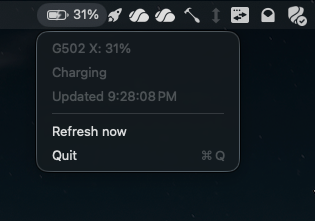

# Squeak

Menu-bar battery readout for Logitech wireless devices on macOS, without G Hub.
Talks HID++ to Logitech receivers directly via IOKit. No G Hub, no Options+, no daemon.

Lists every Logitech device reachable over a receiver, each with its battery `%` and charge state. Click one in the dropdown to favourite it as the menu-bar primary: its level shows as the icon (with a bolt when charging), and stays as a dimmed last-known reading while it's asleep or disconnected.

## Install

    Scripts/install.sh

Builds a release `.app`, copies it to `~/Applications`, and launches it. Re-run to update. Remove with `Scripts/uninstall.sh`.

Launch-at-login is off by default. Turn it on (and choose whether the percentage shows in the menu bar, plus how often the battery is polled) from the app's Settings window: click the menu-bar item and choose "Settings...".

The app is ad-hoc signed, so if Gatekeeper objects, right-click the app in `~/Applications` and choose Open once. No special permissions needed (reading battery over HID++ isn't Input Monitoring).

## Layout

- `Sources/HIDPPKit` - the HID++ 2.0 transport (open receiver, send/receive reports, resolve features, read battery).
- `Sources/Squeak` - the SwiftUI `MenuBarExtra` app (no Dock icon).
- `Sources/squeakprobe` - a plain CLI that polls battery and dumps every HID++ frame to stderr. Use this to debug the protocol.

## Build / run from source

    swift build
    swift run Squeak

## Probe (debugging)

    ./.build/debug/squeakprobe          # poll battery, print BATTERY: NN% <state>
    ./.build/debug/squeakprobe -v       # same, with full HID++ frame dump
    ./.build/debug/squeakprobe diag     # which receiver hosts the mouse (Powerplay vs dongle), slot, %, charge state
    ./.build/debug/squeakprobe list     # every Logitech battery device: name, %, state, transport, stable id

The app dumps the same traffic if launched with `SQUEAK_DEBUG=1`.

## Notes

The mouse must be awake to answer (a sleeping mouse returns `ERR_BUSY` and the read fails); the app retries a few times on launch then polls every two minutes, so it picks up a reading once you touch the mouse. Verified on macOS 26 against a G502 X Lightspeed, including charge/discharge state.

### Devices and the favourite

Each poll scans every tracked receiver across pairing slots `0x01`-`0x03` and the receiver itself (`0xFF`), reading battery plus the device name (feature `0x0005`) and a stable unit id (feature `0x0003`) so a favourite survives sleep/reconnect. The dropdown lists what it finds; clicking a row stores its id as the favourite, and the menu-bar icon follows that device. An offline favourite keeps its last-known reading, drawn dim.

Logitech devices connected over **Bluetooth** (e.g. an MX Master 3S on BLE) are not supported. macOS exposes only their standard mouse HID interface over BLE, with no HID++ vendor collection (`0xFF00`/`0xFF43`) and no battery property, so there's nothing to read. Pair such a device to a Bolt/Unifying receiver and it shows up through the normal path.

### HID++

- Receiver enumerates as VID `0x046D`, usage page `0xFF00`. More than one Logitech receiver can be present (`0xC547` standalone dongle, `0xC53A` Powerplay mat); the app sets up all matching collections and broadcasts each request, routing the reply by device index + feature + swID.
- Frame: `[reportID, deviceIndex, featureIndex, funcID<<4|swID, params...]`. Short report `0x10` (7 bytes), long `0x11` (20 bytes). The IOKit input buffer already includes the report ID as byte 0.
- Wireless device sits at slot `0x01` on the receiver; `0xFF` addresses the receiver itself. The G502 X Lightspeed exposes UNIFIED_BATTERY (`0x1004`) at feature index 6; `get_status` (func 1) returns state-of-charge % in the first param byte and charge status in the third (`0`=discharging, `1/2`=charging, `3`=full).
- Each request draws two replies: an immediate short `ERR_BUSY` (0x08) ack, then the real answer as a separate long report. Ignore the BUSY and wait for the real one.
- Do NOT mix the manager dispatch queue with per-device input callbacks: registering an input callback inside the manager's activate-applier traps (`EXC_BREAKPOINT`). Enumerate with `IOHIDManagerCopyDevices`, then give each device its own queue + activate.

## License

MIT
